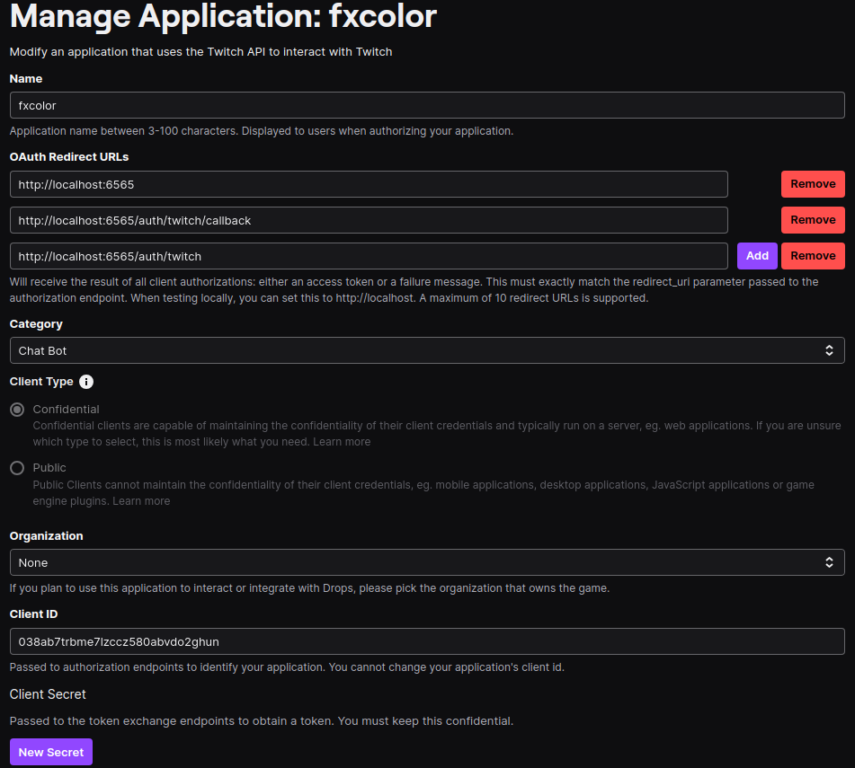

##  TwitchColorChanger &mdash; v2

### Change color of your name on twitch using delay.

#

### installation & deploying:

___ㅤ1. download [nodejs](https://nodejs.org/en/download/package-manager) LTS version.___

___ㅤ2. fork and download this repo.___

___ㅤ3. change [variables](#twitch) in «.env.example» file.___

___ㅤ4. rename ".env.example" to «.env».___

___ㅤ5. deploy on render or [use local](#development).___

ㅤ

#

### list of dependecies:
___ㅤ[dotenv](https://www.npmjs.com/package/dotenv).___

___ㅤ[express](https://www.npmjs.com/package/express).___

___ㅤ[open](https://www.npmjs.com/package/open).___

___ㅤ[axios](https://www.npmjs.com/package/axios).___

___ㅤ[chalk](https://www.npmjs.com/package/chalk).___

___ㅤ[nodemon](https://www.npmjs.com/package/nodemon).___

#

### development:

__- `npm i` or `yarn`__

__- `yarn dep --- for deploy`__

__- or__

__- `yarn dev --- for development`__

__- `if you have older version of nodejs, change it in «.nvmrc» file`__

#

### twitch:

#

### License: [MIT](./license.md)

#

### if you questions?

___ㅤwrite in [issues](https://github.com/fxhxyz4/TwitchColorChanger/issues)___
